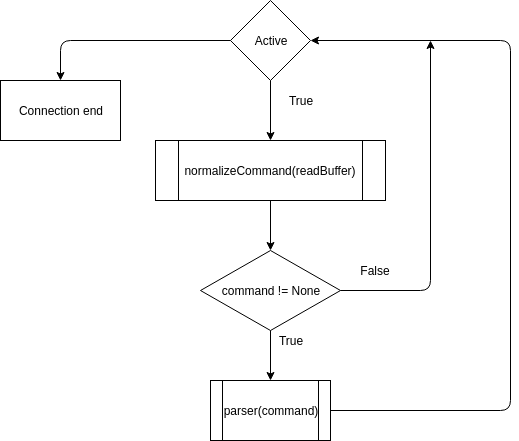
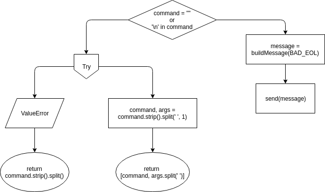
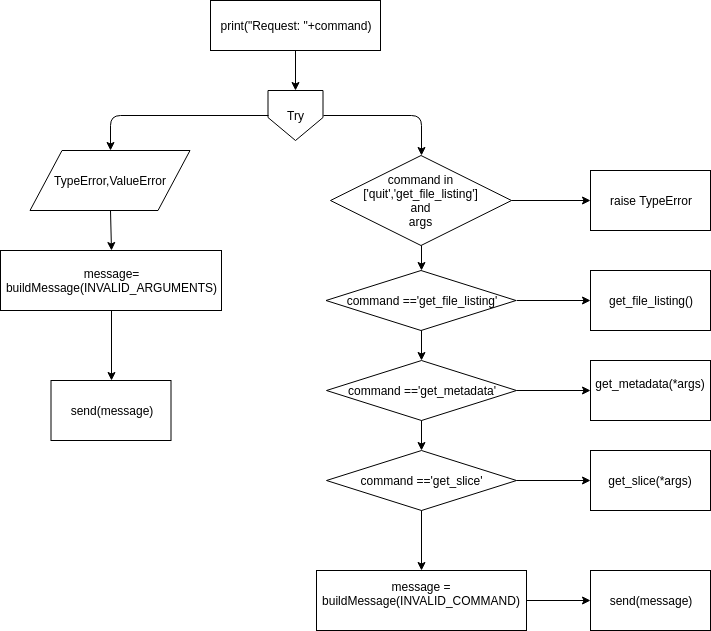
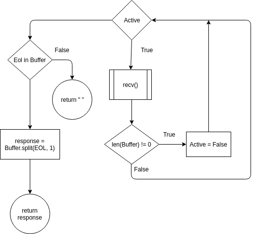

# Aplicación Servidor
# Indice
1. ¿Cómo funciona un servidor?
2. Proyecto
    
    2.1 Funciones
    
    2.2 Excepciones
    
    2.3 Errores

3. Servidor Multicliente
    
    2.2 Selectors
    
    2.3 Threads

4. Bibliografía

5. Integrantes del grupo

## ¿Cómo funciona un servidor?
------------------------------


Veamos las funciones que llama el servidor para crear un **listening** socket:

    socket()
    bind()
    listen()
    accept()

El socket espera a que los clientes se conecten, cuando esto sucede el servidor hace
una llamada a la función `accept()` para poder completar la conexión.

Por otra parte el cliente llama a la función `connect()` para poder establecer
la conexión con el servidor e iniciar lo que se conoce como *three-way handshake*, que no
es nada más que una forma de asegurarse que el cliente se pueda comunicar con el servidor
en la network y vice-versa.

Para comunicarse entre ellos tanto el servido como el cliente utilizan las funciones.
    
    send()
    recv()

Por último una vez que el cliente no necesita comunicarse más con el servidor , envia 
un mensaje para indicarle que no va enviar más mensajes y cierra su respectivo 
socket usand `close()`.

## Proyecto
-----------
### Funciones

#### Handle(self):


#### Normalize_command(self, command):


#### Parser_command(self, command, args=None):


#### Read_buffer(self):



-------------------------------
Cuando el cliente o el servidor usan la funcion `send()` pueden surgir complicaciones. ¿Cuál es el problema?. Muy simple send() devuelve la cantidad de bytes enviados, pero puede llegar a pasar que esa cantidad es menor al tamaño de la información que se quiere enviar.
> Las aplicaciones son responsables de verificar que toda la información haya sido enviada ; si sólo se envió una parte , la aplicación tiene que enviar la información que resta.

Podemos evitar este inconveniente utilizando la función `sendall()`
> A diferencia de send(), este metodo continua enviando la información hasta que se envia todo u ocurre un error. En caso de exito se devuelve cero.
------------------------------

## Servidor Multicliente
Volviendo a como funciona un servidor cabe destacar que el método descripto sólo funciona para un cliente. Entonces ¿Cómo hacemos para manejar multiples clientes al mismo tiempo?. Existen varias formas de implementar un servidor multicliente:

###Selectors 

Si usamos la **systemcall** `select()` podemos fijarnos que socket's tiene la E/S para leer/escribir, dependiendo del caso. Para ello se puede utilizar la librería *Selectors*. 
``` python
    import selectors
    selector = selectors.DefaultSelector()
    
    socket = socket.socket(socket.AF_INET, socket.SOCK_STREAM)
    socket.bind((host, port))
    socket.listen()
    
    print('listening on', (host, port))
    
    socket.setblocking(False)
    sel.register(socket, selectors.EVENT_READ, data=None)
```
La mayor diferencia con el servidor que sólo puede manejar un cliente a la vez es que tenemos es la llamada a la función 
socket.setblocking(False) que sirve para configurar el socken en un modo *non-blocking*.
> Una función o método que temporalmente suspende tu aplicacion se llama *blocking call*, por ejemplo accept() o send() no retornan inmediatamente.Las "Blocking calls" tienen que esperar a systemcall's para terminar antes que devuelvan un valor.

Sel.register() como lo dice el nombre registra el socket para que sea monitoreado con `sel.select()` 
para eventos en los que estamos interesados. La información es recivida cuando la llamada a `sel.select()` termina.

### Threads   
``` python
    def multiclient(self,conn,addr):
        self.lock_print.acquire()
        print("%s Connected by %s" % (
            threading.current_thread().name,
            addr)
        )

        self.lock_print.release()

        point_to_point_conn = c.Connection(
            conn,
            self.directory,
            self.lock_print
        )
        point_to_point_conn.handle()
        point_to_point_conn.s.close()

    def serve(self):
        while True:
            conn, addr = self.s.accept()
            thread = threading.Thread(target=self.multiclient,args =(conn,addr))
            # .daemon hace que el thread se muera una vez que termina su tarea
            thread.daemon = True
            thread.start()
```

La primera diferencia que notamos con el servidor de un único cliente, es que una vez que haceptamos la conexión 
en vez de crear una instancia de la clase **Connection** creamos un hilo utilizando la llamada a la función `threading.Thread()`. El "target" es la función que se va a llamar una vez que se inicie el hilo (esto se hace utilizando el método **.start()**) y "args" son los argumentos que toma dicha función.

> Daemon es una variable booleana que pertece a la clase "Thread" e indica si el hilo es daemon o no. Esta variable se tiene que modificar antes de que se llame a .start(), si no se levanta la excepción "Runtime Error". El valor inicial se hereda del Hilo que lo crea. Cundo la variable está en True significa que el hilo va a ser eliminado una vez que termina de hacer su tarea, en nuestro caso atender a un cliente.

Por otro lado utilizamos un "lock" (Candado) con el nombre print_lock para imprimir en la terminal y que dos o más hilos no traten de hacerlo al mismo tiempo, para eso utilizamos los siguientes métodos:

> Acquire(): Se queda esperando hasta que el lock no esté bloqueado y después lo bloquea.

> Release(): libera el lock previamente adquirido.

Para más información sobre [Lock](https://docs.python.org/2/library/threading.html#lock-objects)


## Bibliografía
1. [Servidor Multicliente (Ejemplo)](https://www.geeksforgeeks.org/socket-programming-multi-threading-python/)

2. [Servidor Multicliente usando Selectors](https://realpython.com/python-sockets/#multi-connection-client-and-server)

3. [Libreria Selectors](https://docs.python.org/3/library/selectors.html)

4. [Libreria Thread](htthttps://docs.python.org/2/library/thread.html)

## Integrantes del Grupo
- Gonzalo Gigena
- Leandro Acosta
- Joaquin de Francesca