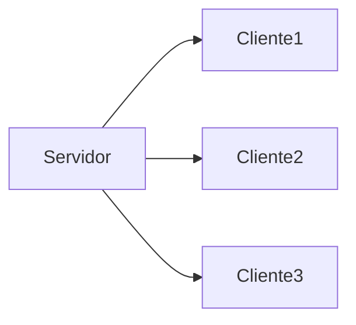

# Aplicación Servidor

## Implementacón

### Funciones

### Excepciones 

### Errores

## Servidor Multi-Client
Existen varias formas de implementar un servidor que sea capaz de manejar varios clientes al mismo tiempo.
Entre las más destacadas se encuentran las librerias **Selectors** y **_thread**

El primero  permite una eficiente multiplexación de E/S de alto nivel, construida sobre la libreria **Select**.

>Para más información visitar [Selectors](https://docs.python.org/3/library/selectors.html)

El segundo (que vamos a usar en nuestro caso) es una libreria que como dice el nombre utiliza **hilos**
>Un [ejemplo](https://www.geeksforgeeks.org/socket-programming-multi-threading-python/) de un servidor multi cliente que utiliza esta libreria.
>Por otro lado , la documentación de la libreria se encuentra [aquí](https://docs.python.org/2/library/thread.html).

## Integrantes del Grupo
- Gonzalo Gigena
- Leanro Acosta 
- Joaquin de Francesca
